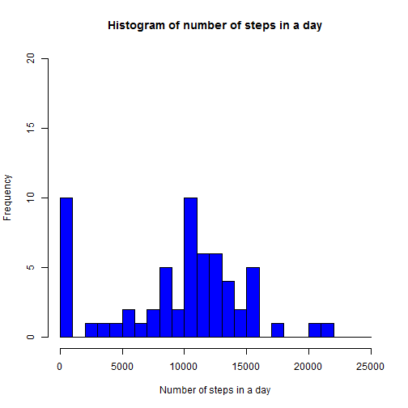
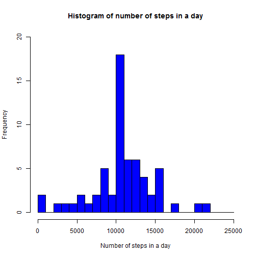
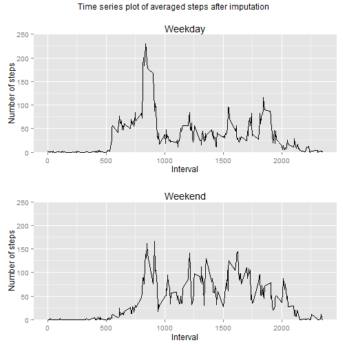

This study analyses the activity monitoring data.

##Loading and Preprocessing data

The data loaded is in a good shape, ready for analysis. Hence no preprocessing is required. The data has three columns 'Date', 'Interval' and 'Steps' indicating the data of measurement, 5 minute interval and the number of steps in that interval respectively. 


```r
library(dplyr)
library(ggplot2)
library(chron)
library(gridExtra)
activity_data = read.csv("./activity.csv", colClasses = c("numeric", "character", "numeric"))
```

##Total number of steps taken per day


The data set has many missing values in the 'Steps' column. We ignore the missing values while calculating the total number of steps taken per day.


####Histogram of total number of steps taken

**dplyr** package is used for grouping data by date.


```r
data_grouped_by_date = group_by(activity_data, date)
summary_by_date = summarize(data_grouped_by_date, total_no_of_steps = sum(steps, na.rm=TRUE))
hist(summary_by_date$total_no_of_steps, main = "Histogram of number of steps in a day", xlab = "Number of steps in a day", col = "blue", breaks = seq(from = 0, to = 25000, by = 1000), ylim = c(0,20))
```

 

```r
mean_steps = round(mean(summary_by_date$total_no_of_steps),2)
median_steps = median(summary_by_date$total_no_of_steps)
```


####Mean and median of the total number of steps taken per day

Mean is **9354.23**. 
Median is **10395.00**.


##The average daily activity pattern

####Time series plot of daily averaged activity pattern

Inorder to analyse the the daily activity pattern averaged across all days, the data is grouped by intervals. There are 288 5-minute intervals, corresponding to each 5-min interval in a single day(24 * 12). The averaged steps vector is plotted for each of the 288 intervals. 

```r
data_grouped_by_interval = group_by(activity_data, interval)
summary_by_interval = summarize(data_grouped_by_interval, avg_steps_in_interval = mean(steps, na.rm = TRUE))
plot(summary_by_interval$interval, summary_by_interval$avg_steps_in_interval, type="l", xlab = "Index of the 5 minute Interval", ylab = "Average steps", main = "Time series plot of averaged steps")
```

 

```r
max_steps = max(summary_by_interval$avg_steps_in_interval)
max_interval = summary_by_interval$interval[which.max(summary_by_interval$avg_steps_in_interval)]
```


####Averaged maximum number of steps

The maximum value of the averaged steps is **206.17**. The maximum value occurs at the **835** 5-minute interval.


##Imputing missing values

There are **2304** missing values in the activity set. Missing values constitute **13** % of the data set.


```r
sum(is.na(activity_data))
```

```
## [1] 2304
```

As the number of steps taken in a 5 minute interval on a given day is closely correlated with the steps taken on the same 5 minute interval on the other days, it would be appropriate to fill the missing values with a value based on the steps taken in that 5-minute interval.
The missing values are replaced with the **mean of that 5-minute interval**.


```r
new_activity_data = data.frame(activity_data)
for(i in 1:nrow(new_activity_data))
{
  if(is.na(new_activity_data[i, ]$steps) == TRUE)
  {
    j = which(summary_by_interval$interval == new_activity_data[i,]$interval)
    new_activity_data[i, "steps"] = summary_by_interval[j,]$avg_steps_in_interval
  }
}
fill_in_missing_data = function(x)
{
        if(is.na(x))
        {
                x$a = b
        }
}
```


####Mean and Median of the new data set

The histogram of the new data set is plotted. The histogram of the new data set is more close to the **normal distribution**. This is because the missing values are given approximate values and hence the number of rows having mean of zero have gone down.


```r
new_data_grouped_by_date = group_by(new_activity_data, date)
new_summary_by_date = summarize(new_data_grouped_by_date, total_no_of_steps = sum(steps, na.rm=TRUE))
hist(new_summary_by_date$total_no_of_steps, main = "Histogram of number of steps in a day", xlab = "Number of steps in a day", col = "blue", breaks = seq(from = 0, to = 25000, by = 1000), ylim = c(0,20))
```

 

```r
new_mean_steps = round(mean(new_summary_by_date$total_no_of_steps),2)
new_median_steps = median(new_summary_by_date$total_no_of_steps)
```

The new mean is 10766.19. The new median is 10766.19. It can be inferred that both the mean and median have **increased**, and they are equal.

##Differences in activity patterns between weekdays and weekends

A new variable indicating whether the given day is a weekday or weekend is created. A figure drawing the comparisions between the average steps on weekends and weekdays is drawn. We could note a few differences in both the plots. The average number of steps is maximum during the weekdays.


```r
new_activity_data = mutate(new_activity_data, day_type = factor(1*is.weekend(chron(new_activity_data$date, format = "y-m-d")), 
       labels = c("WD", "WE")))
we_summary = subset(new_activity_data, new_activity_data$day_type == "WE") %>% group_by(interval) %>% summarize(mean_steps = mean(steps))
wd_summary = subset(new_activity_data, new_activity_data$day_type == "WD") %>% group_by(interval) %>% summarize(mean_steps = mean(steps))
p1 = ggplot(we_summary, aes(x = we_summary$interval, y = we_summary$mean_steps)) + xlab("Interval") + ylab("Number of steps") + coord_cartesian(ylim = c(0, 250))
p2 = ggplot(wd_summary, aes(x = wd_summary$interval, y = wd_summary$mean_steps)) + xlab("Interval") + ylab("Number of steps") + coord_cartesian(ylim = c(0, 250))
grid.arrange(p2 + geom_line() + ggtitle("Weekday"),p1 + geom_line() + ggtitle("Weekend"), nrow = 2, top = "Time series plot of averaged steps after imputation")
```

 

